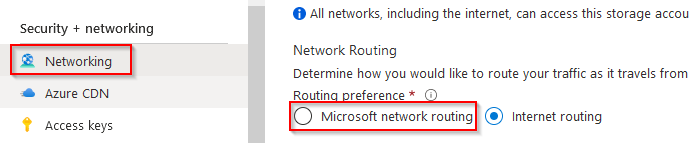
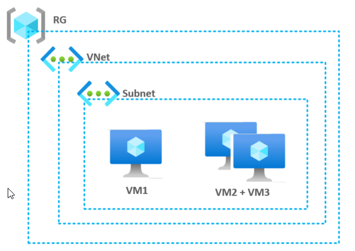
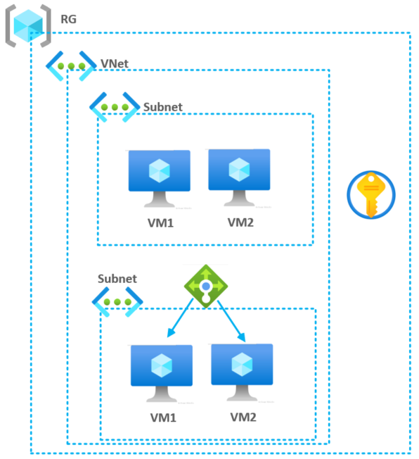

# **Welcome to Bicep**

  

**Au menu**:
- C'est quoi Bicep ? 
- Les basiques du langage 
- Conversion ARM vers Bicep
- Deploiement d'une petite plateforme

**TLDR** : [Bicep in Nutshell](takeaway.md)
(Or with [one picture](Tools/True-ARM.jpg))

# **Survival guide**

1. **Prerequis & installation**

* Souscription Azure 
* VS Code avec son extension Bicep
* Azure CLI
* Bicep 

Verification:
> az bicep version  >> Bicep CLI version **0.4**.63

Pour les retardataires: 
```code
choco install bicep
choco install azure-cli
choco install vscode
```

2. **Les liens**

- [GitHub Bicep](https://github.com/Azure/bicep) 
- [GitHub Bicep - Tuto](https://github.com/Azure/bicep/blob/main/docs/tutorial/01-simple-template.md) 
- [Doc Azure ARM](https://docs.microsoft.com/en-us/azure/templates/) 
- [Code Sheet](codesheet.md) 

# **Hackaton Bicep**

**NOTE** Sources dans le dépot

## **1. Basique Bicep**

**Goals**
>- Déclarer un RG + une resource Azure
>- Variables et paramètres
>- Rapide comparaison avec Terraform 
>- Deployer son premier template

### **Tips**
**Structure d'une resouce**
```Bicep 
resource myResouceName 'Microsoft.Resources/<type>@<api>' = {
  name: <name>
}
```
```Bicep 
resource rg 'Microsoft.Resources/resourceGroups@2021-04-01' = {
  name: rgName
  location: location
}
```
**Variable et param**
```Bicep 
param myParam type  = 'xxx'
var myVariable = '${var1}-string'
```

### **Todo**
- Créez un fichier **rg.bicep**
- Creer un resouce group **"_Prod-labBicep01-rg_"**
- Créez un fichier **storage.bicep**
- Creer un storage account
    - Activez cette option pour la config réseau:


- Déployez le resouceGroup
- Déployez le Storage Account

**Help** 
- [Bicep - Basic](https://github.com/Azure/bicep/blob/main/docs/tutorial/01-simple-template.md)
- [Bicep - Deploy](https://github.com/Azure/bicep/blob/main/docs/tutorial/02-deploying-a-bicep-file.md)


## **2. Plateforme basique**
**Goals**
>- Organisation en module
>- Dépendances, gestion des outputs les boucles



### **A créer**
- Un resource group __labBicep**02**__
- Un Virtual Network (simple)
- Une VM **VM1** indépendante
- Deux VM **VM2 VM3** déployées via une boucle

### **Todo**
- Créez un fichier **main.bicep**
    - Déployer un resouce group __labBicep**02**__
- Créer plusieurs fichiers **Bicep** pour chaque type de resource
    - Network, VM
    - Appellez vos resources depuis le **main.bicep** via des modules
- Pour le réseau, simplifiez: Un seul address space , un seul subnet (création en boucle dans le module 4)
- Pour les VM
    - Credential hardcodé
    - Créez une première VM unitairement
    - Créez ensuite deux VM en utilisant une boucle sur le module VM

> Deployez entre chaque étape. Ne pas hésitez à supprimer le RG/change son nom

**Help** 
- [Bicep - Module](https://github.com/Azure/bicep/blob/main/docs/tutorial/06-creating-modules.md)
- [Bicep - Boucle](https://github.com/Azure/bicep/blob/main/docs/tutorial/05-loops-conditions-existing.md)


Proprietés pour VM 
offer | publisher | sku | vmSize
--- | --- | --- | --- 
WindowsServer | MicrosoftWindowsServer | 2019-Datacenter | Standard_D2s_v3

**Tips VM** : Il faut une network interface avant de créer la VM 

## **3. Conversion ARM / Bicep**

**Bicep is ARM**

Convertisez un de vos précédents fichiers **Bicep en ARM** et observez le template ARM
```Bicep
bicep build main.bicep
```
Convertir un template **ARM en fichier Bicep**
```Bicep
bicep decompile templateARM.json
```

Convertir un template __réel__ **ARM exporté du portail en Bicep**
```Bicep
bicep decompile container.json
```

**Help** 
- [Bicep - Command line](https://github.com/Azure/bicep/blob/main/docs/tutorial/07-convert-arm-template.md)


## 4. Infra IaaS 2-tiers

Reprennez le module 2 pour réaliser les évolutions suivantes: 
(ordre libre, les changements sont indépendant)

**Network**
> - Modularisez entièrement la partie network
> - Gérer les subjets crées avec un tableau
> - Variabilisez la partie choix du subnet dans les VM

**VM**
> - Récupérez le password dans un key vault existant
> - Déployez au moins 2 VM dans chaque subnet. Utilisez une boucle basée sur un index
> - Ajoutez un load balancer sur l'un des bloc de VM

**Azure DevOps**
> - Deployer votre infra Bicep dans un pipeline
> - Option 1 - Directement depuis un .bicep
> - Option 2 - En convertisant le .bicep en json ARM


